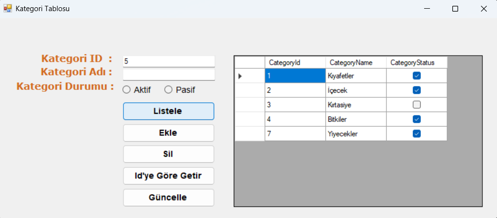
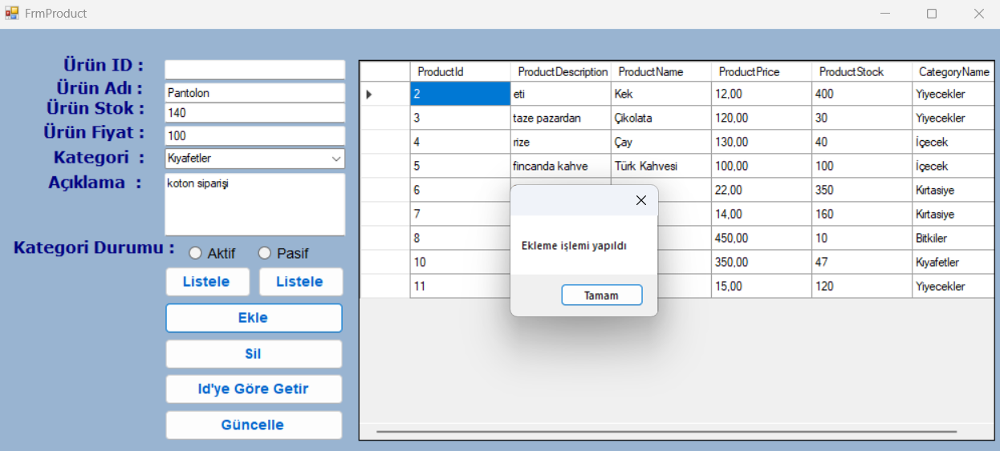

# **📦 Product Management System - Katmanlı Mimari ile Stok Yönetimi**
Bu proje, C# programlama dili ve MSSQL veritabanı kullanılarak, kurumsal yazılım geliştirme standartlarına uygun Katmanlı Mimari (N-Tier Architecture) yapısıyla geliştirilmiştir.

## **🚀 Özellikler** 
**Kategori Yönetimi:** Kategori ekleme, silme, güncelleme ve durum (Aktif/Pasif) takibi.
**Ürün Modülü:** Ürün adı, stok miktarı, fiyat ve açıklama bilgilerinin yönetimi.
**İlişkisel Veritabanı:** Ürünlerin kategorilerle eşleştirilerek kategorize edilmesi.
**Gelişmiş Arama:** Ürün veya kategorileri ID bazlı filtreleme ve listeleme.

##**🏗️ Teknik Mimari ve Katmanlı Yapı**
Proje, Solid prensipleri temel alınarak, her katmanın kendi sorumluluğuna sahip olduğu Servis Tabanlı Katmanlı Mimari ile kurgulanmıştır:
**Data Access Layer:** Veritabanı ile doğrudan iletişim kuran katmandır. EFProductDal ve EFCategoryDal sınıfları aracılığıyla Entity Framework kullanılarak veritabanı CRUD işlemleri (Ekleme, Silme, Güncelleme, Listeleme) bu katmanda gerçekleştirilir.
**Business Logic Layer :** Projenin iş mantığının ve kontrol mekanizmalarının bulunduğu katmandır. ProductManager ve CategoryManager sınıfları, gelen verileri işleyerek gerekli doğrulamaları yapar ve Data Access katmanıyla güvenli köprü kurar.
**Entity Layer:** Veritabanındaki tabloların (Ürün ve Kategori) C# tarafındaki karşılığı olan sınıfları (Product, Category) barındırır.
**Presentation Layer (UI):** Kullanıcının etkileşime geçtiği Windows Forms katmanıdır. FrmProduct_Load aşamasında kategoriler dinamik olarak ComboBox'a yüklenir ve ürünlerle ilişkili şekilde listelenir.

## **📸 Uygulama Ekran Görüntüleri**
.png).png).png)
